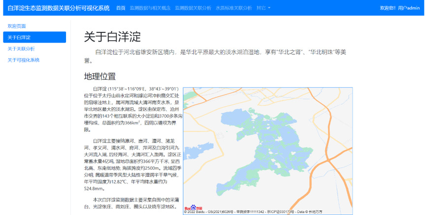
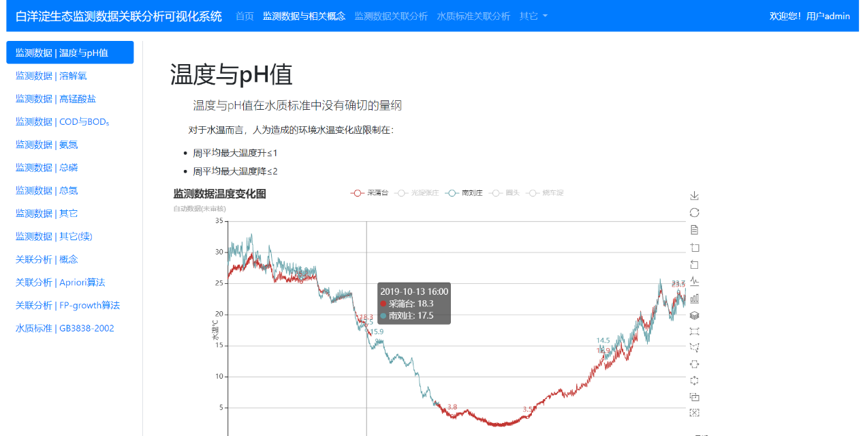
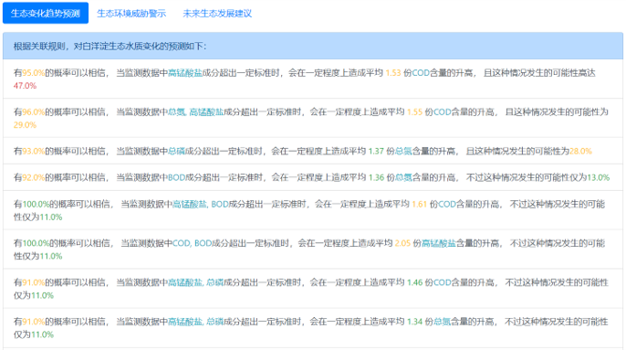
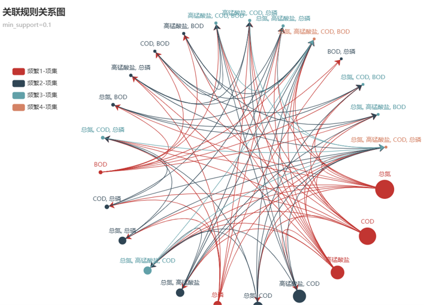

# 白洋淀检测数据关联分析系统的设计与实现
## The design and construct of an association analysis system of BaiYang lake's monitor data
这是我的本科毕业设计，目前代码已开源，**但原始数据暂不开源**。

## 一、🚗运行环境说明🚗
_本系统基于Python3.8语言编写，使用的包管理工具为pip，使用的编译器为PyCharm2022，使用的数据库为MySQL8.0_

#### 1、请先确认Python是否正确安装，以及Python版本是否为3.8及以上。
在cmd里输入：`python --version` 
若输出为 Python3.8.6 ，则说明Python环境已正确安装。  
若未正常输出或Python版本过低，请前往 _https://www.python.org/downloads/release/python-386_  
以下载Python3.8.6的安装包，并依照安装包的指示正确安装即可。  
安装完成以后，在cmd中输入`python --version`以及`pip --version`应该能够正常输出其对应的版本号。
#### 2、接下来，需要安装好系统所依赖的包文件。
在终端里输入下列命令：  
`pip install -r requirements.txt`  
安装完毕后，本系统所依赖的所有第三方模块以及这些模块所依赖的其它模块就应该已经被正确安装了  
#### 3、接下来，请确认MySQL数据库是否正确安装，以及MySQL版本是否为8.0及以上。
在终端里输入下列命令：  
`mysql --version`  
若输出为 `mysql  Ver 8.0......` ，则说明MySQL数据库已经正确安装。  
若未正常输出或MySQL版本过低，请前往 _https://dev.mysql.com/downloads/installer_ 以下载MySQL8.0的安装包，并依照安装包的指示正确安装即可。  
#### 4、最后，本系统前端可视化界面所使用的框架为Bootstrap4，该框架不支持IE9及以下版本的浏览器。为确保最佳浏览效果，建议使用Google Chrome或Chromium内核的Edge浏览器进行浏览。
## 二、🎉安装配置说明🎉
#### 1、使用编辑器打开webView/webView/settings.py文件，修改第85行至第89行的数据库相关信息，包括数据库名称、数据库登录名与密码，数据库地址及端口号。然后，在MySQL中手动创建一个与第85行数据库名称相同的数据库。
#### 2、运行webView/refresh_database.bat文件，初始化数据库中表的信息。
#### 3、运行webView/create_superuser.bat文件，创建一个Django数据库管理模块的超级管理员。按照提示输入用户名，邮箱和密码进行注册。
#### 4、运行webView/launch.bat文件。
首先进入 _http://127.0.0.1:8000/updateData_ 与 _http://127.0.0.1:8000/updateArticle_ 以进行数据库数据的初始化，  
接下来再进入 _http://127.0.0.1:8000_ ，即可正常进入该系统。
## 三、🍔其它说明🍔
#### 1、由于本系统的数据库并非按照常规的SQL文件进行转储，所有的数据都是由代码生成的。所以第一次登录系统时并没有用户可供直接登录，需首先自行注册一个用户，即可使用该用户进行正常登录。请注意，这里的用户与上文create_superuser.bat中所注册的非同一个用户。
#### 2、由于数据量较大的原因，在访问“监测数据与相关概念”页面时可能会出现页面响应时间较长的问题，请耐心等待片刻。
#### 3、“监测数据关联分析”与“水质标准关联分析”页面中的“上传数据”处，只有上传data目录下的四个Excel文件，才能正常进行关联分析操作。
#### 4、“监测数据关联分析”中的最小支持度建议设置为0.2及以下，“水质标准关联分析”中的最小支持度建议设置为0.1及以下。
#### 5、在“其它”菜单下的“数据库管理”页面，即可使用在上文create_superuser.bat中注册的超级管理员进行登录。